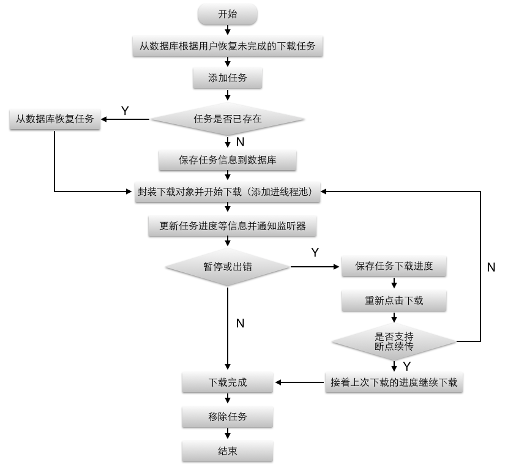

# FileDownloader
###Android下载框架,支持多用户、多任务、断点续传


###使用只需要几行配置代码

#### 1、在androidmanifest.xml里配置DownLoadService
```
 <service android:name="com.zhuiji7.filedownloader.download.DownLoadService" />
```
#### 2、初始化，在Application的 onCreate() 函数里启动DownLoadService 
```
    this.startService(new Intent(this, DownLoadService.class));
```
#### 3、在用户登录后设置用户信息以及服务器是否支持断点续传<br>
```
   /*获取下载管理器，DownLoadManager 对象只能通过DownLoadService.getDownLoadManager()获取，不能通过new的方式 */
   DownLoadManager manager = DownLoadService.getDownLoadManager();
   /*设置用户ID，客户端切换用户时可以显示相应用户的下载任务*/
   manager.changeUser("luffy");
   /*断点续传需要服务器的支持，设置该项时要先确保服务器支持断点续传功能*/ 
   manager.setSupportBreakpoint(true);
```   
#### 4、在需要下载的地方添加下载任务<br>
```
  manager.addTask(“id_001”, "http://sqdd.myapp.com/myapp/qqteam/AndroidQQ/mobileqq_android.apk", "qq.apk");
   /*监听下载任务*/
  manager.setSingleTaskListener("id_001", new DownLoadListener(){
      @Override
      public void onStart(SQLDownLoadInfo sqlDownLoadInfo) {
        //开始下载
     } 
      @Override
     public void onProgress(SQLDownLoadInfo sqlDownLoadInfo, boolean isSupportBreakpoint) {
        //更新进度
     } 
      @Override
     public void onStop(SQLDownLoadInfo sqlDownLoadInfo, boolean isSupportBreakpoint) {
         //停止下载
     } 
     @Override
     public void onError(SQLDownLoadInfo sqlDownLoadInfo) {
         //下载出错
     } 
     @Override
     public void onSuccess(SQLDownLoadInfo sqlDownLoadInfo) {
         //下载成功
     } 
  }); 
```

###流程图

